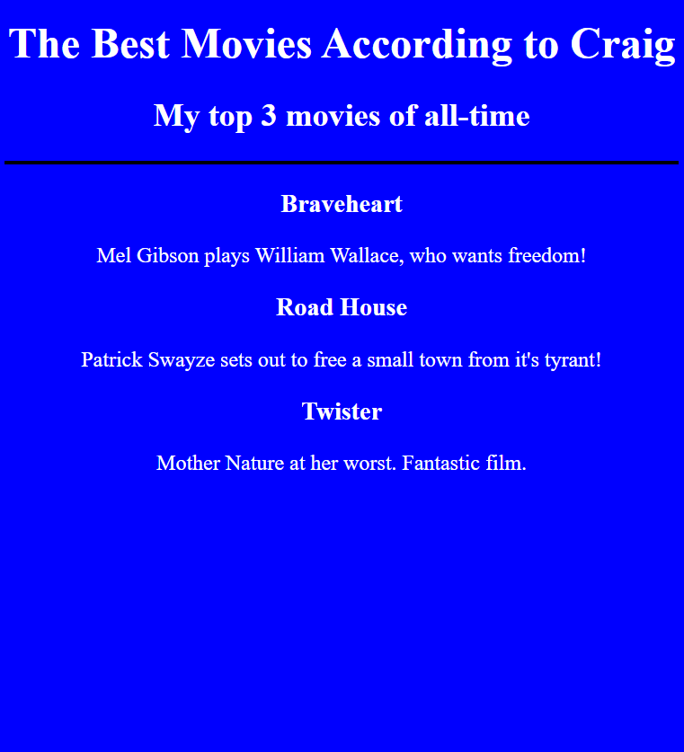
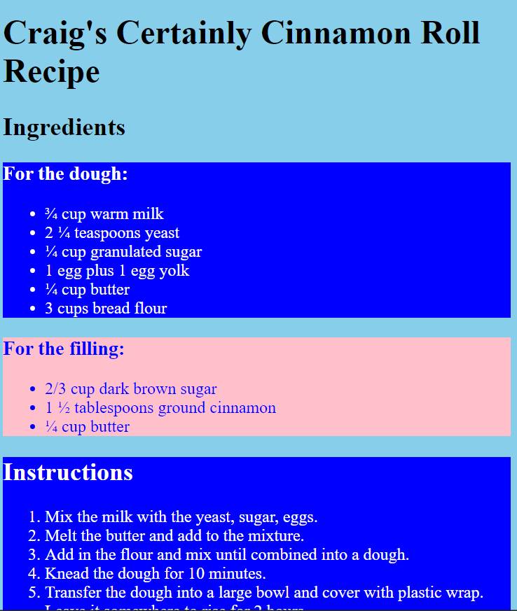

- [Complete Web Development Bootcamp Udemy course](#complete-web-development-bootcamp-udemy-course)
  - [Overview](#overview)
  - [HTML](#html)
    - [Heading Elements `<h></h>`](#heading-elements-hh)
      - [Header Challenge!](#header-challenge)
      - [Heading Element Code](#heading-element-code)
    - [Paragraph Elements `

`](#paragraph-elements-pp)
      - [Paragrah Challenge!](#paragrah-challenge)
      - [Paragraph Element Code](#paragraph-element-code)
    - [Void Elements (Self-Closing Tags).](#void-elements-self-closing-tags)
      - [Void Element challenge!](#void-element-challenge)
      - [Void element Code](#void-element-code)
    - [Movie Ranking Project.](#movie-ranking-project)
      - [Movie Ranking Project Code](#movie-ranking-project-code)
    - [List Elements](#list-elements)
      - [List Element Challenge](#list-element-challenge)
      - [List Elements Code](#list-elements-code)
    - [Nesting and Indentation](#nesting-and-indentation)
    - [Anchor Elements](#anchor-elements)

# Complete Web Development Bootcamp Udemy course

## Overview

This project follows along with a Udemy course on Web Development using HTML, CSS, Bootstrap, React and others.

Although I have experience with HTML and CSS, I have never documented any of my work and so I will be completing sections that I am already familiar with in order to document them properly.

Each section will contain a index.html file which is where my work will be found. There will also be a solution.html which shows the instructors solution along with a goal.png to illustrate the instructors solution.

## HTML

What is HTML?

HTML - Hyper Text Markup Language is what we use to define what will be on our web page and in what order they should be displayed in our browser.

### Heading Elements `<h></h>`

Heading Elements are used to turn text into headers. there are 6 header tags `<h1></h1> - <h6></h6>` and should be used to indicate different header sizes/importance throughout our web page. 

The `<h1></h1>` element defines the main page header and there should only be 1 in each html file.

#### Header Challenge!
Assign header tags to create a book contents page.
#### [Heading Element Code](<Heading_Element>)

### Paragraph Elements `

`

The paragraph element `

` is used to seperate paragraphs of text and uses an open and close tag.

#### Paragrah Challenge!

Assign paragraph tags to the text in order to render paragraphs in the browser.

#### [Paragraph Element Code](Paragraph_Element)

### Void Elements (Self-Closing Tags).

There are a number of elements that are self closing and so do not require a closing tag at the end.

an example of these are:

` ` - Line break
`
` - Horizontal Rule (draws a horizontal line across the page).

They are known as 'void elements' because they essentially create a 'void' on the screen to separate text.

#### Void Element challenge!

Format the document to match the instructors example. It should contain h1, P, br and an hr at minimum.

#### [Void element Code](Void_Elements)

### Movie Ranking Project.

Replicate the instructors Movie ranking webpage. Adding 3 Movies of My Choice.

I added a simple css stylesheet to change background color, align text to centre and make the hr black

#### [Movie Ranking Project Code](Movie_Ranking_Project)

### List Elements

List elements provide us with a list style formatting. we can have a bullet point style list or a numbered list:

ul = unordered list (bullet points)
ol = ordered list (numbers)

#### List Element Challenge

format the document to match the instructors solution. Use `ul` and `ol` to create a recipe page.

I also added a css stylesheet with some basic css formatting.

#### [List Elements Code](List_Elements)

### Nesting and Indentation

### Anchor Elements

