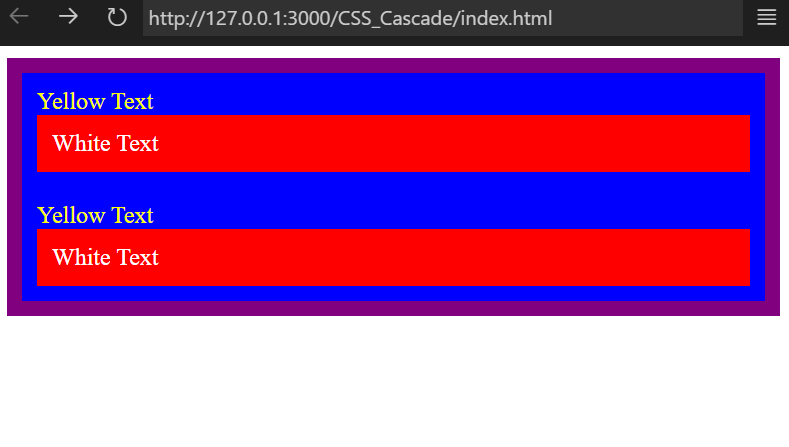
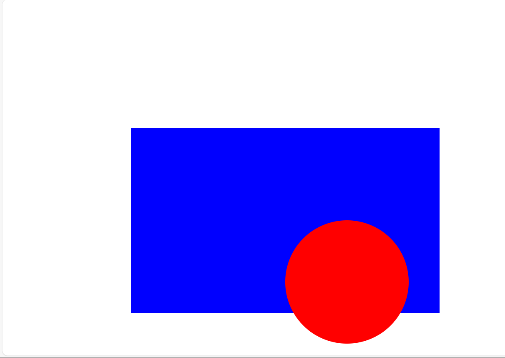
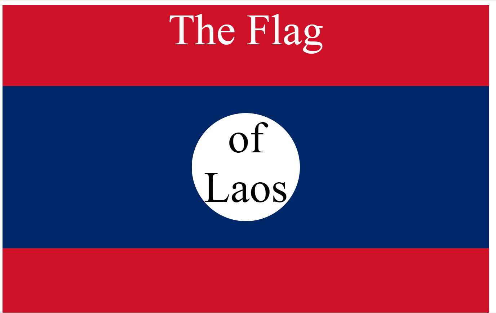
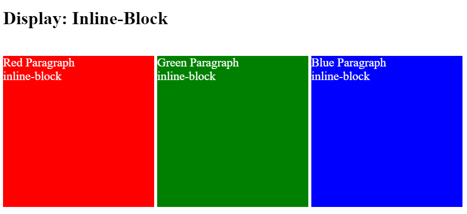
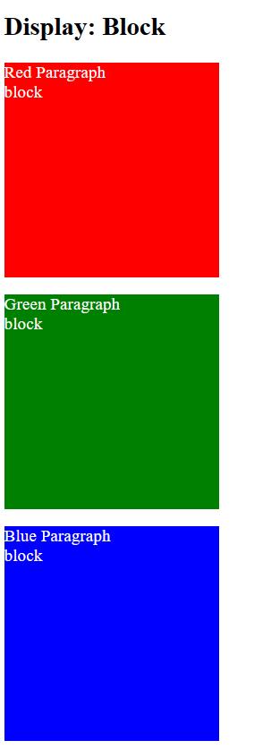
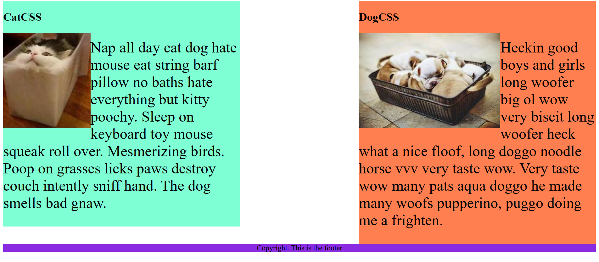
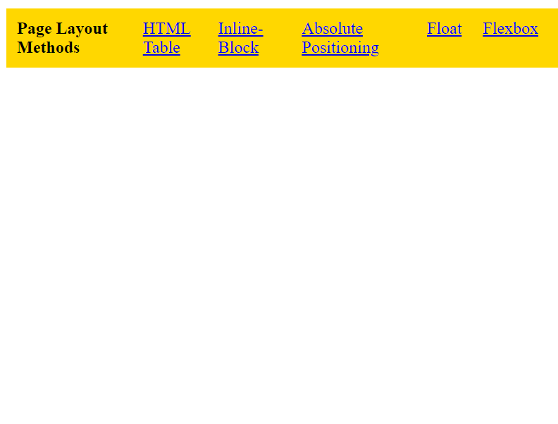

- [Complete Web Development Bootcamp Udemy course](#complete-web-development-bootcamp-udemy-course)
  - [Overview](#overview)
  - [Capstone Projects](#capstone-projects)
    - [Capstone Projects Link](#capstone-projects-link)
  - [HTML](#html)
    - [Heading Elements `<h></h>`](#heading-elements-hh)
      - [Header Challenge!](#header-challenge)
      - [Heading Element Code](#heading-element-code)
    - [Paragraph Elements `<p></p>`](#paragraph-elements-pp)
      - [Paragraph Challenge!](#paragraph-challenge)
      - [Paragraph Element Code](#paragraph-element-code)
    - [Void Elements (Self-Closing Tags)](#void-elements-self-closing-tags)
      - [Void Element challenge!](#void-element-challenge)
      - [Void element Code](#void-element-code)
    - [Movie Ranking Project](#movie-ranking-project)
      - [Movie Ranking Project Code](#movie-ranking-project-code)
    - [List Elements](#list-elements)
      - [List Element Challenge](#list-element-challenge)
      - [List Elements Code](#list-elements-code)
    - [Nesting and Indentation](#nesting-and-indentation)
      - [Nesting \& Indentation Code](#nesting--indentation-code)
    - [Anchor Elements](#anchor-elements)
      - [Anchor Elements Code](#anchor-elements-code)
    - [Image Elements](#image-elements)
      - [image Elements Code](#image-elements-code)
    - [Birthday Party Invite Project](#birthday-party-invite-project)
      - [Birthday Invite Code](#birthday-invite-code)
    - [Webpages](#webpages)
      - [Webpages code ](#webpages-code-)
    - [Personal Portfolio Project](#personal-portfolio-project)
      - [Personal Portfolio Link](#personal-portfolio-link)
      - [Personal Portfolio Code](#personal-portfolio-code)
  - [CSS](#css)
    - [Adding CSS](#adding-css)
      - [Adding CSS Code](#adding-css-code)
      - [Inline CSS](#inline-css)
      - [Internal CSS](#internal-css)
      - [External CSS](#external-css)
    - [CSS Selectors](#css-selectors)
      - [CSS Color Vocab Project](#css-color-vocab-project)
      - [CSS Color Vocab Project Code](#css-color-vocab-project-code)
    - [CSS Colors](#css-colors)
      - [CSS Colors Code](#css-colors-code)
    - [Font Properties](#font-properties)
      - [Font Properties Code](#font-properties-code)
    - [CSS Box Model](#css-box-model)
      - [CSS Box Model Code](#css-box-model-code)
    - [Motivational Poster Project](#motivational-poster-project)
      - [Motivational Poster Project Code](#motivational-poster-project-code)
    - [CSS Cascade](#css-cascade)
      - [CSS Cascade Code](#css-cascade-code)
    - [CSS Positioning](#css-positioning)
      - [CSS Positioning Code](#css-positioning-code)
    - [CSS Flag Project](#css-flag-project)
      - [CSS Flag Code](#css-flag-code)
    - [CSS Display](#css-display)
      - [CSS Display Code](#css-display-code)
    - [CSS Float](#css-float)
      - [CSS Float Code](#css-float-code)
  - [Responsive Web Design](#responsive-web-design)
    - [Responsiveness](#responsiveness)
      - [Example Responsive Web Design Code](#example-responsive-web-design-code)
    - [Media Queries](#media-queries)
      - [Media Queries Code](#media-queries-code)
    - [Web Design Project](#web-design-project)
      - [Web Design Agency Project Code](#web-design-agency-project-code)
    - [Flexbox](#flexbox)
      - [Display: flex code](#display-flex-code)
    - [Flex Direction](#flex-direction)
      - [Flex-direction Code](#flex-direction-code)
    - [Flex Layout](#flex-layout)
      - [`order: 0;`](#order-0)
    - [flex-wrap](#flex-wrap)
    - [justify-content](#justify-content)
    - [align-items](#align-items)
    - [align-self](#align-self)
    - [align-content](#align-content)
  - [CSS Tricks - Flexbox Cheat Sheet](#css-tricks---flexbox-cheat-sheet)
  - [Javascript](#javascript)


# Complete Web Development Bootcamp Udemy course

## Overview

This project follows along with a Udemy course on Web Development using HTML, CSS, Bootstrap, React and others.

Although I have experience with HTML and CSS, I have never documented any of my work and so I will be completing sections that I am already familiar with in order to document them properly.

Each section will contain a index.html file which is where my work will be found. There will also be a solution.html which shows the instructors solution along with a goal.png to illustrate the instructors solution.

## Capstone Projects

Here you will find Capstone projects that have been set during this course. Each project will contain a readme file with project requirements and must be completed from scratch. There will be no code-along or instructor walk-through for these projects and they will be my own work.

### [Capstone Projects Link](Capstone_Projects)

## HTML

What is HTML?

HTML - Hyper Text Markup Language is what we use to define what will be on our web page and in what order they should be displayed in our browser.


### Heading Elements `<h></h>`

Heading Elements are used to turn text into headers. there are 6 header tags `<h1></h1> - <h6></h6>` and should be used to indicate different header sizes/importance throughout our web page. 

The `<h1></h1>` element defines the main page header and there should only be 1 in each html file.

#### Header Challenge!
Assign header tags to create a book contents page.
#### [Heading Element Code](<Heading_Element>)


### Paragraph Elements `<p></p>`

The paragraph element `<p></p>` is used to seperate paragraphs of text and uses an open and close tag.

#### Paragraph Challenge!

Assign paragraph tags to the text in order to render paragraphs in the browser.

#### [Paragraph Element Code](Paragraph_Element)


### Void Elements (Self-Closing Tags)

There are a number of elements that are self closing and so do not require a closing tag at the end.

an example of these are:

`<br>` - Line break
`<hr>` - Horizontal Rule (draws a horizontal line across the page).

They are known as 'void elements' because they essentially create a 'void' on the screen to separate text.

#### Void Element challenge!

Format the document to match the instructors example. It should contain h1, P, br and an hr at minimum.

#### [Void element Code](Void_Elements)

### Movie Ranking Project

Replicate the instructors Movie ranking webpage. Adding 3 Movies of My Choice.

I added a simple css stylesheet to change background color, align text to centre and make the hr black

#### [Movie Ranking Project Code](Movie_Ranking_Project)


### List Elements

List elements provide us with a list style formatting. we can have a bullet point style list or a numbered list:

ul = unordered list (bullet points)
ol = ordered list (numbers)

#### List Element Challenge

format the document to match the instructors solution. Use `ul` and `ol` to create a recipe page.

I also added a css stylesheet with some basic css formatting.

#### [List Elements Code](List_Elements)

<br>

### Nesting and Indentation
#### [Nesting & Indentation Code](Nesting_and_Indentation)<br>
<br>


### Anchor Elements

#### [Anchor Elements Code](Anchor_Elements)<br>
<br>

### Image Elements
#### [image Elements Code](Image_Elements)<br>
<br>

### Birthday Party Invite Project

In this project I was tasked with creating a birthday party invite incorporating an image, ordered list, unordered list and a link to google maps.

#### [Birthday Invite Code](Birthday_Invite_Project)


### Webpages

what is a webpage? Well, a website is made up of a collection of files(usually html) that link to each other using anchor tags. For example we might have a home web page (or homepage) that has an 'About Me' Link. When clicked, this link will take the user to another webpage that contains information about me. The 'About me' page might then have a link to the homepage. This is essentially what webpages are. Each separate page on the website has it's own file.

In this section i will be creating a basic website with a homepage, an 'about me' section that can be accessed by clicking on my profile picture and a 'contact me' link that takes the user to contact information.

#### [Webpages code ](Webpages)


### Personal Portfolio Project

Here I will be creating a personal portfolio website using only html. It will be a multi-site webpage with links to individual projects, about me page and contact details page.

This portfolio can be found at this link:

#### [Personal Portfolio Link](https://craigwoodcock.github.io/html-portfolio/)

#### [Personal Portfolio Code](HTML_Porfolio_Project)


## CSS

CSS - Cascading Stylesheet is a style sheet that we use to add styles and formatting to html documents.

### Adding CSS

We can add CSS to our webpages with 3 methods: Inline, Internal Stylesheets and External Stylesheets

#### [Adding CSS Code](Adding_CSS)

#### Inline CSS

we can use inline styles when we only need to change 1 element on the page. we do this by setting the `style` attribute on the element itself like so:

```
<h1 style="color: blue;">Style Me in Blue!</h1>
```

#### Internal CSS

we can use Internal CSS styles, this is added to the 'head' of the html document. This is not recommended as it could make editing more challenging later on. By using internal css, we can only use that css on that particular html document.

```
<head>
 <style>
    h1 {
      color: red;
    }

  </style>
</head>

```

#### External CSS

External CSS is preferred as it means we can reuse components and formatting accross our website making it uniform and easier to modify.

we add a `<link>` tag to the head of our html document and specify the style.css file;

```
 <link rel="stylesheet" href="style.css">
```

we then specify our styles inside that `style.css` file:

```
h1 {
    color: green;
}

```
### CSS Selectors

we can target different elements using different selectors:

```
/* targets all paragraphs */
p {
  color: red;
}

/* targets everything with the class of "note" */
.note{

  font-size: 20px;
}

/* targets the element with the id of "id-selector-demo" */
#id-selector-demo {
  color: green;
}

/* targets a list item with the value attribute of 4 */
li[value="4"]{

  color: blue;
}

/* targets all elements */
* {

  text-align: center;
}

```

The above CSS produces the following output:


#### CSS Color Vocab Project


TODOs
IMPORTANT: You should not need to make ANY CHANGES to index.html
All code should be written in your CSS file.

1. Create a CSS file and incorporate it as an external stylesheet.
2. Use CSS to style each of the color titles to meaning. 
Hint: Use the id to help if you don't know the words in spanish.
3. Use CSS to change all the color titles to have "font-weight: normal;"
4. Use CSS (not HTML) to make all the images 200px heigh and 200px wide. 
   
#### [CSS Color Vocab Project Code](Color_Vocab_Project)

### CSS Colors 

 1. Make the background of the webpage "antiquewhite"
 2. Make the h1 "whitesmoke"
 3. Make the background of the h1 "darkseagreen"
 4. Make the h2 #FAF8F1
 5. Make the background of the h2 "#C58940"

#### [CSS Colors Code](CSS_Colors)


### Font Properties

1. Change the color of <p>Color</p> to "coral" color.
2. Change the font size of <p>Font Size</p> to 2X the size of the root font size.
3. Change the font weight of <p>Font Weight</p> to 900.
4. Change the font family of <p>Font Family</p> to the Google font Caveat with regular (400) font weight.
Link: https://fonts.google.com/specimen/Caveat
1. Change the <p>Text Align</p> to right align.
2. Change the the root (html element) font size to 30px

#### [Font Properties Code](Font_Properties)


### CSS Box Model

TO-DO!

1. Create 3 Boxes using the div element.
2. Set their sizes to 200px heigh by 200px wide.
3. Set different background colors for each of the boxes (I used cadetblue, gold and indianred).
4. Add a paragraph <p> element into the first div and add the following words:
    Lorem ipsum dolor sit amet, consectetur adipiscing elit. Aliquam at sapien porttitor urna elementum lacinia. In
    id magna pulvinar, ultricies lorem id, vehicula elit. Aliquam eu luctus nisl, vitae pellentesque magna. Phasellus
    dolor metus, laoreet ac convallis sit amet, efficitur sed dolor.
5. Set the 1st div to have 20px padding all around with a black 10px border.
6. Fix the style of the <p> element to remove all margins.
Hint: Use the CSS inspector in Chrome.
7. Set the 2nd div to have a 20px border on top and bottom and 10px border left and right. (See goal image)
8. Set the 3rd div to have a 10px border 
9. Set the margins for the divs so that each box corner touches the other. (See the goal image)

#### [CSS Box Model Code](CSS_Box_Model)


### Motivational Poster Project

 TODO: Create a motivational post website.
Style it how ever you like. 
Look at the goal image for inspiration.
But it must have the following features:
1. The main h1 text should be using the Regular Libre Baskerville Font from Google Fonts:
  https://fonts.google.com/specimen/Libre+Baskerville
2. The text should be white and background black.
3. Add your own image into the images folder inside assets. It should have a 5px white border.
4. The text should be center aligned.
5. Create a div to contain the h1, p and img elements. Adjust the margins so that the image and text are centered on the page. 
  Hint: You horizontally center a div by giving it a width of 50% and a margin-left of 25%.
  Hint: Set the image to have a width of 100% so it fills the div. 
6. Read about the text-transform property on MDN docs to make the h1 uppercase with CSS.
  https://developer.mozilla.org/en-US/docs/Web/CSS/text-transform 

#### [Motivational Poster Project Code](Motivational_Meme_Project)


### CSS Cascade

Use CSS to make my index.html code look like this:


html:

```
<body>
  <div id="outer-box" class="box">
    <div class="box">
      <p>Yellow Text</p>
      <div class="box inner-box">
        <p class="white-text">White Text</p>
      </div>
    </div>
    <div class="box">
      <p>Yellow Text</p>
      <div class="box inner-box">
        <p class="white-text">White Text</p>
      </div>
    </div>
  </div>
</body>

```

My CSS:

```
.box {
  background-color: blue;
  padding: 10px;
}

.inner-box{
  background-color: red;
}

#outer-box{
  background-color: purple;
}
p {
  color: yellow;
  margin: 0;
  padding: 0;
}

.white-text{
  color: white;
}

```

Output: 

#### [CSS Cascade Code](CSS_Cascade)




### CSS Positioning

Copy the Instructors goal.png using CSS.

#### [CSS Positioning Code](CSS_Positioning)



### CSS Flag Project

Create the flag of Laos using CSS.

#### [CSS Flag Code](CSS_Flag_Project)



### CSS Display

TODO
1. By changing only the display property of the CSS make all 3 squares line up horizontally like in goal1 image.
2. Change only the display property to make all 3 squares line up vertically like in goal2 image. 

#### [CSS Display Code](CSS_Display)




### CSS Float

TODO
1. Make both paragraph elements wrap around the image.
2. Use Float to move the cat div to the left and the dog div to the right.
3. Use clear to make the footer go below both the cat and dog div.

#### [CSS Float Code](CSS_Float)



## Responsive Web Design

### Responsiveness

#### [Example Responsive Web Design Code](Responsive_Web_Design)

### Media Queries

TODO: Change the background color for each device
[lightsalmon] Mobile Devices: 319px — 480px
[powderblue] iPads and Tablets: 481px — 1200px
[limegreen] Laptops: 1201px — 1600px
[seagreen] Desktops: 1601px and more

My Solution:
```
  <style>
    body {
      background-color: aquamarine;
    }
    @media(max-width:480px){
      body{
        background-color: lightsalmon;
      }
    }
    @media(min-width:481px) and (max-width:1200px){
      body{
        background-color: powderblue;
      }
    }
    @media(min-width:1201px) and (max-width:1600px){
      body{
        background-color: limegreen;
      }
    }
    @media(min-width:1601px){
      body{
        background-color: seagreen;
      }
    }
   
  </style>

```

#### [Media Queries Code](Media_Queries)

### Web Design Project

Create a responsive Web Design Agency website using media queries to make the website responsive to different screen sizes.

#### [Web Design Agency Project Code](Web_Design_Agency_Project)

### Flexbox

Change the display property of the navbar to utilise flexbox and make the elements inline.

#### [Display: flex code](Display_Flex)



### Flex Direction

We can control the flow of elements when using flex by changing it's direction. By default, flex-direction is set to 'row' so elements in a flex container will be inline elements.

we can change this by adding the following CSS:

`flex-direction: column`

now elements inside the container will be stacked like block elements.

#### [Flex-direction Code](Flex_Direction)


### Flex Layout

#### `order: 0;`

By default, all flex items have an order of 0. we can change the order of elements by applying the order property.

The following code will make the `.red` item appear last and the `.indigo` item appear first.

```
    .red {background-color: #eb4d4b;
    order: 1;}
    .orange {background-color: #f0932b;}
    .yellow {background-color: #f6e58d;}
    .green {background-color: #6ab04c;}
    .blue {background-color: #4834d4;}
    .indigo {background-color: #30336b;
    order: -1;}
    .purple {background-color: #be2edd;}

```
### flex-wrap

Setting `flex-wrap: wrap` on the flex container will force flex items in the container to wrap onto the next line when there is not enough space for all of the items to be on the same line.

be default this property is set to `nowrap`

`wrap-reverse` will wrap the items in reverse order, so the last item will be placed onto the line above on the far left. 

### justify-content

This allows us to control the position of flex-items along the main axis(by default this is the horizontal axis, unless flex-direction is set to column).

  - flex-start: positions the content at the start of the flex container.
  - flex-end: positions the content at the end of the flex container.
  - center: positions the content in the center of the flex container.
  - space-evenly: distributes space evenly between all items.
  - space-between: pushes the outer items to the edge and evenly distributes space between the remaining items.
  - space-around: positions the items so that the space at the two outer edges combined equals the same as the space between the other items. eg. if the gap between two items is 10px, then the gap between the first item and the edge of the container will be 5px and the gap between the last item and the edge of the container will also be 5px.

### align-items

This allows us to position the content along the cross axis(top to bottom).
For this to work correctly, we need the container to be taller than the content so that we can move the content around in the container.

This only works when `flex-wrap` is set to `nowrap`.

  - flex-start: positions items at the top of the container.
  - flex-end: positions items at the bottom of the container.
  - center: positions the items in the center of the container.
  - stretch: stretches the items to fill the height of the container.

### align-self

we can use `align-self` on the child item to set its individual position within the container.

### align-content

We use align-content to align content along the main axis when `flex-wrap` is set to `wrap`.


## CSS Tricks - Flexbox Cheat Sheet

[CSS Flexbox Cheat Sheet Link](https://css-tricks.com/snippets/css/a-guide-to-flexbox/)


## Javascript
